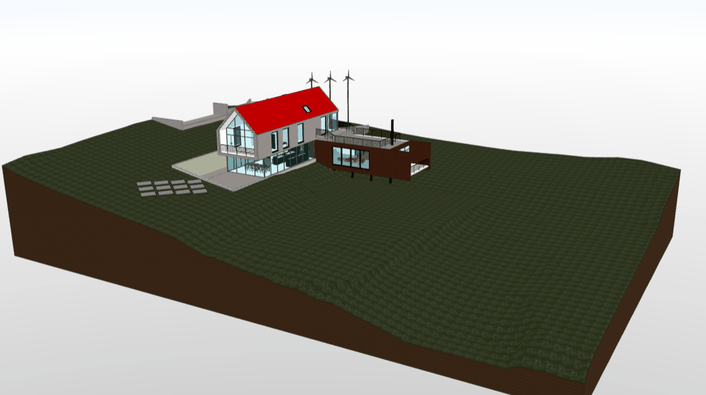
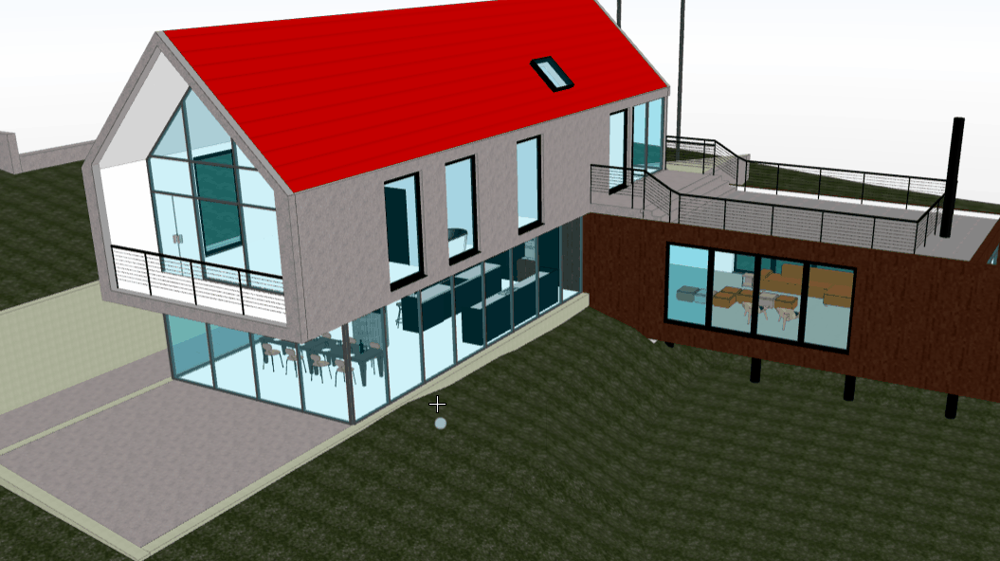
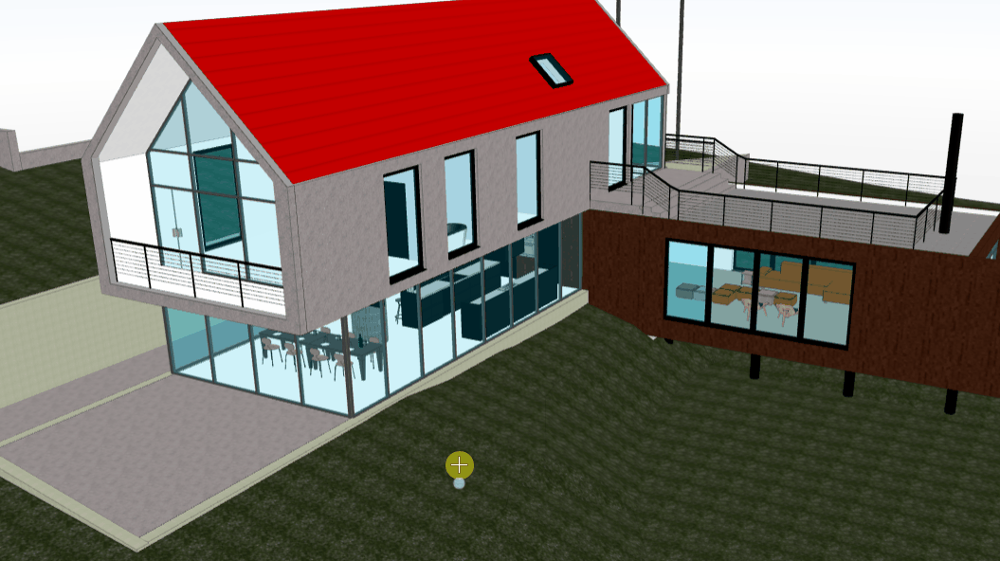
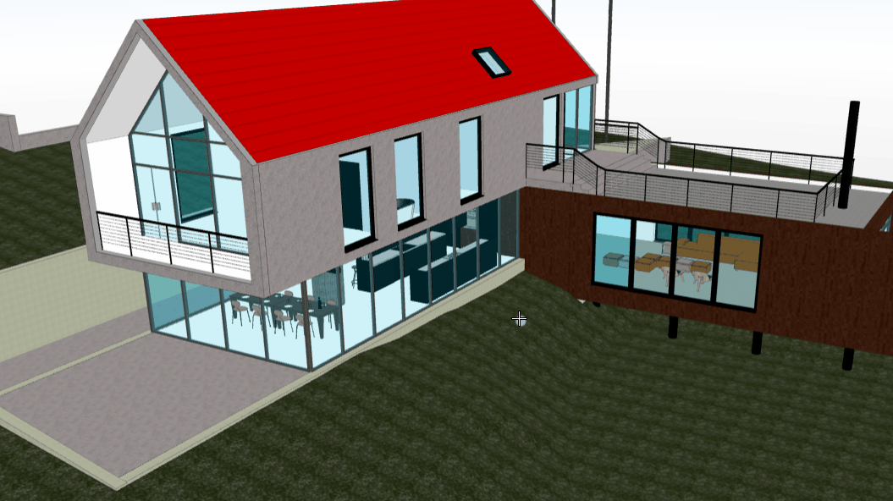

# bim viewer
BIM Viewer is a WebGL based front-end project that I created in my spare time. It is aimed to display BIM (Building Information Modeling) models, it supports gltf, obj, fbx, ifc, dae, etc. Since it is build on top of three.js, you can easily extend it to support any format that three.js support.

This project is not mature yet, it's more like a demostration. There are many TODOs as you can see below. It is unfortunate that I could not continue work on it, that's why I make it open source, and I hope it could benifit others who are in BIM/AEC industries.

## Project setup
```
npm install
```

### Compiles and hot-reloads for development
```
npm run serve
```

### Compiles and minifies for production
```
npm run build
```

### Lints and fixes files
```
npm run lint
```

## Features
- Load and view model in 3D


- Orthographic camera


- Distance measurement


- Area measurement


- Angle measurement


- Section plane


- Section box


- Component selection


- Display outline


- Transparent mode


## Add your own projects
You can add your own projects or models by editing [projects.json](public/config/projects.json). Add following to projects.json, and put your models under `public/projects/my_project` folder.
```
{
    "id": "my_project",
    "name": "my project",
    "thumbnail": "projects/my_project/thumbnail.png",
    "models": [{
      "name": "my model",
      "src": "projects/my_project/my_model.gltf",
      "merge": false,
      "edges": true
    }]
  }
```

## TODOs
There are so many features to be implemented, many bugs to be fixed, as well as enhancements:
- Annotation manager
- Viewpoint manager
- Roaming
- Model Exploder
- Object property dialog
- Toolbar
- Project Setting
- Navigation cube
- Post-processing
- GIS data (OGC services, GIS files, etc.)
- ...

## `three.js`
- [three.js release](https://github.com/mrdoob/three.js/releases): `v0.148.0`
